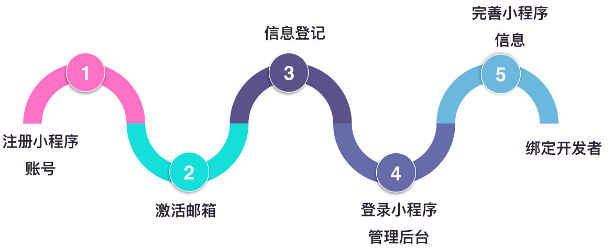
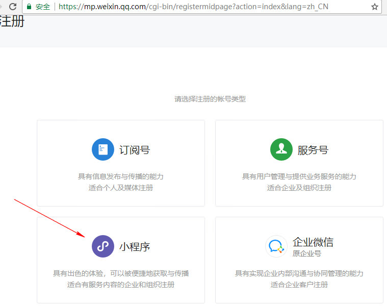
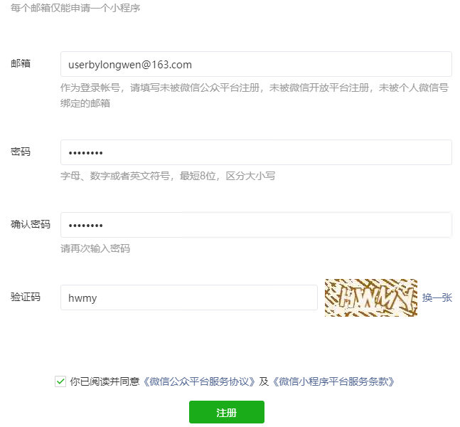
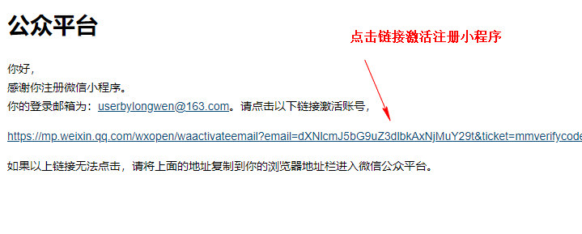
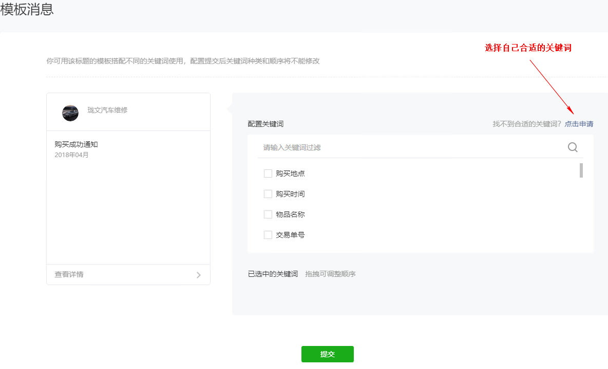

# 注册微信小程序

[TOC]

## 开发前的准备

1. 注册小程序账号
  * 微信公众平台 https://mp.weixin.qq.com
  * 注册邮箱细节
    * 不能是微信公众平台，微信开发平台注册过的
    * 也不能是个人微信号去绑定的邮箱
2. 下载安装小程序开发者工具
[安装开发工具](https://developers.weixin.qq.com/miniprogram/dev/#%E4%BD%A0%E7%9A%84%E7%AC%AC%E4%B8%80%E4%B8%AA%E5%B0%8F%E7%A8%8B%E5%BA%8F)

---

## 1 登录微信公众平台

## 2 选择小程序注册

## 3 填写注册邮箱

## 4 到邮箱点击激活链接

## 5 小程序注册

## 6 创建一个小程序

## 7 填写小程序的名字

## 8 设置小程序

## 9 小程序模板消息

## 10 开启小程序消息推送
