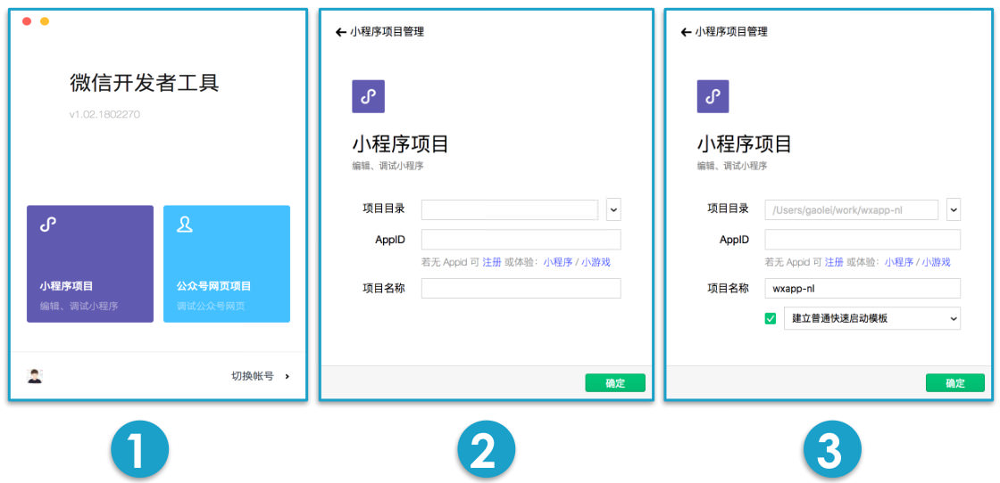
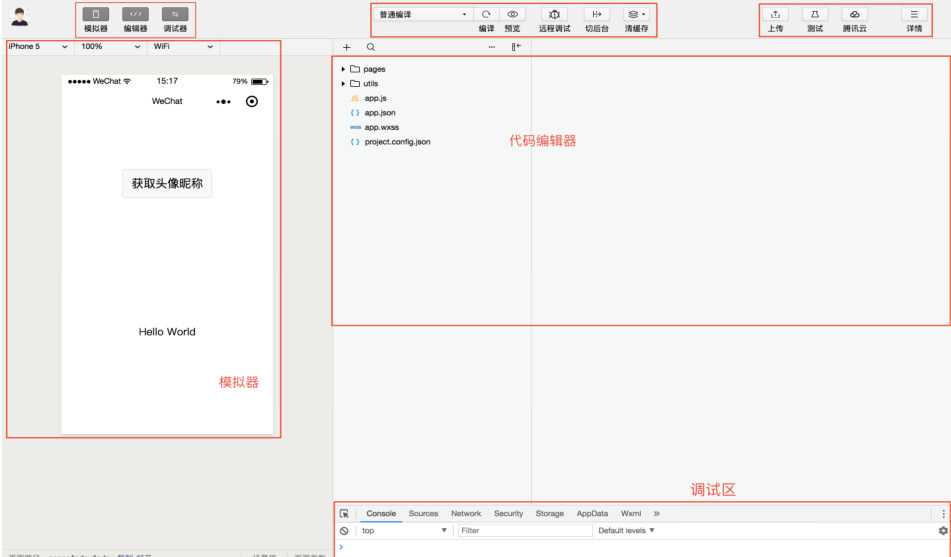
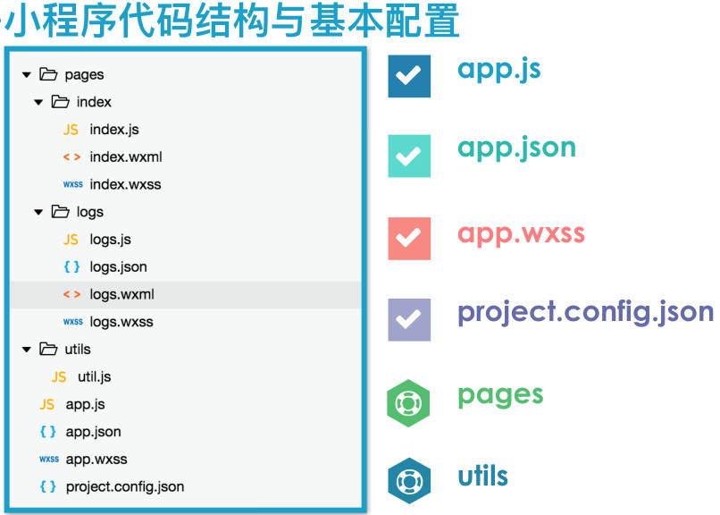
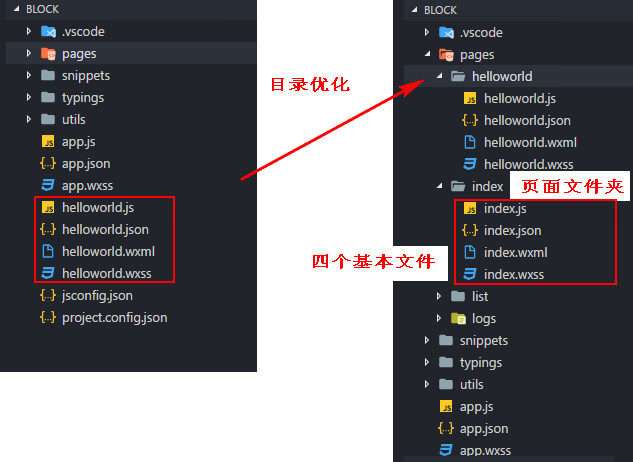
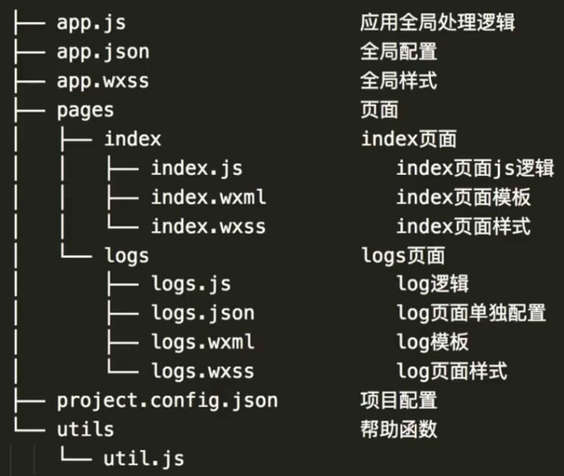
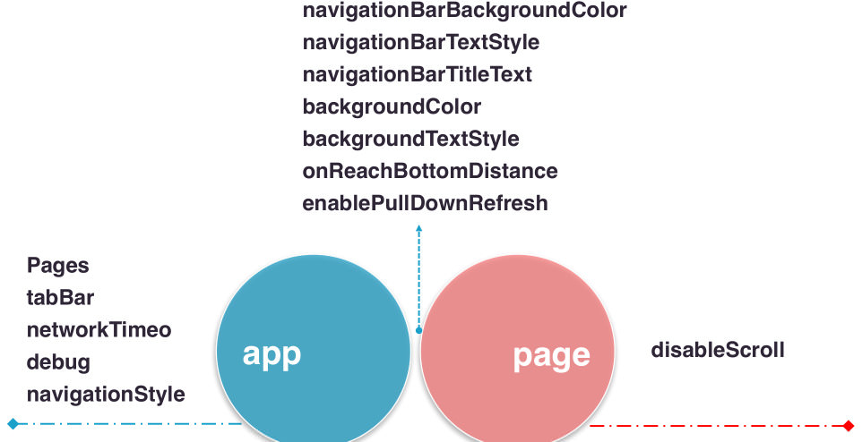

## 1 安装使用微信开发者工具
* 项目目录
  * 
* APPID 重要
* 项目名称
  * 


---


## 2 微信小程序开发工具界面
* 工具栏
* 模拟器
* 编辑器
* 调试器


---


## 3 小程序的版本
* 预览版本
  * 经常在真机上预览开发的样式
* 开发版本
  * 上传上一个带版本的小程序应用
* 体验版本
  * 将开发版本切换成体验版本


---


## 3 微信小程序代码结构

```
├─app.js   注册微信小程序应用，页面逻辑和事件
├─app.json 小程序的全局配置
├─app.wxss 设置微信小程序的全局样式，等价于 css
├─project.config.json 自动生成的项目配置文件
├─utils
|   └util.js 存放工具函数，达到代码复用的目的
├─pages      存放所有的小程序页面
|   ├─logs
|   |  ├─logs.js
|   |  ├─logs.json
|   |  ├─logs.wxml
|   |  └logs.wxss
|   ├─index
|   |   ├─index.js
|   |   ├─index.json
|   |   ├─index.wxml 等价于 html
|   |   └index.wxss

  /page
    存放所有的微信小程序页面，每个页面有4个文件组成
    页面的配置项会覆盖全局的配置项
    *.js   处理逻辑和数据交互
    *.json 页面的配置信息
    *.wxml 展示页面元素和内容
    *.wxss 设置样式

  /pages
    /index
      index.js 逻辑和数据交互，事件
      index.json 页面配置信息，会覆盖 app.json
      index.wxml html
      index.wxss css

  /app.json  全局配置文件
    窗口的表现
      窗体的背景颜色
      下拉时的文字样式
    网络请求超时的时间
    各个页面的注册路径

  index.json 页面配置，会覆盖 app.json 的全局配置
```



---


## 4 小程序全局和页面配置文件
```
/app.json 全局配置
  Pages
    注册小程序的所有页面
  tabBar
    设置页面底部的 tab栏，多页面切换
  newworkTimeout
    各个网络的超时时间
  debug
    开启 debug在调试台显示信息

  navigationStyle / window

  disableScroll 是否开启滚动

  index.json 页面配置项 会覆盖全局配置 app.json
    比如 index.json 覆盖 app.json
```



---


## 5 小程序调试工具各个模块的作用
```
  Console
    打印小程序页面的的 log信息

  
  Sources
    列出小程序页面的所有脚本文件
    可以对这些 JS文件进行断点调试


  Network
    展现网络请求的信息
    所请求资源的一个响应数据等


  Security


  Audits

 
  Storage
    通过wx.setStorage 和 wx.setStorageSync 设置缓存时，
    可以动态的修改缓存数据


  AppData
    小程序真实展示的数据
    可以修改，查看不同设备的兼容性


  Wxml
    类似 html，可以直接修改，添加删除样式和属性


  Sensor
    地理位置信息和设备旋转角度

  Trace

```

## app.js
  App({
    "page": {
      'hello': 'url'
    } 所有的页面
  })
    生命周期钩子函数
    事件函数
    全局的数据

  index.wxss
    view {
      width: 100%;
      height: 50rpx; // rpx 响应式的屏幕像素
      text-align: center;
    }