# WXML语法

[TOC]

## 1 WXML 是什么
* WXML WeiXin Markup Language
* 微信开发框架的基本组成
  * WXML
    * 等价于 HTML
    * 标签都必须小写
    * 大小写敏感
    * 标签必须闭合
    * 所有的组件和属性都是小写

  * WXSS
    * 等价于 CSS
    * class 只能传入静态属性
    * style 可以传入动态属性
    * 静态样式写入 class， 动态样式写入 style

  * WXS
    * WXSS的增强版

  * Javascript

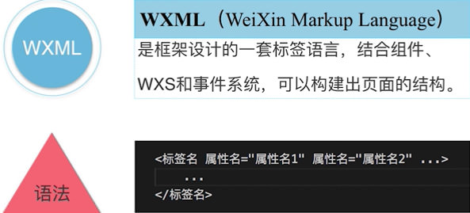

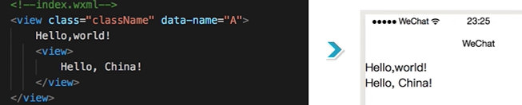

---


## 2 WXML数据特性
* 数据绑定
  * 频繁的动态更新，动态改变界面的能力
* 列表渲染
* if条件渲染
* 模板引用
  * import & include的区别

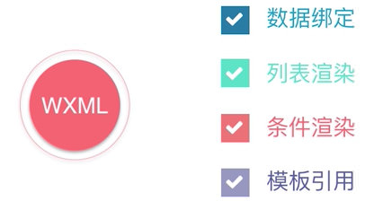

* WXML的属性和事件
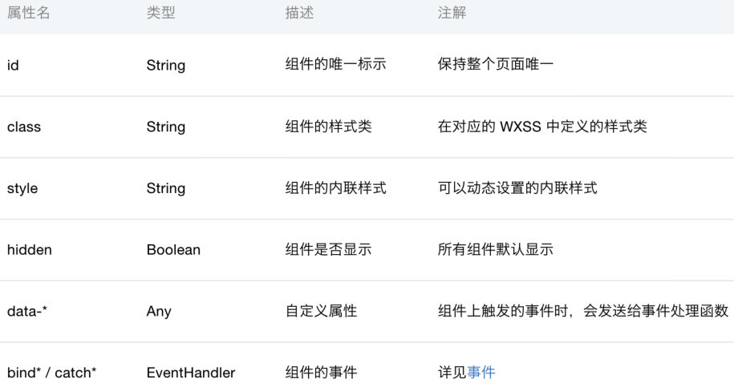
```
<view
  id=""
  class="" 静态属性
  style="" 动态属性
  hidden=""
  data-*=""
  bind=""
  catch=""></view>
```


* 大胡子语法 ` {{  }} ` Mustache

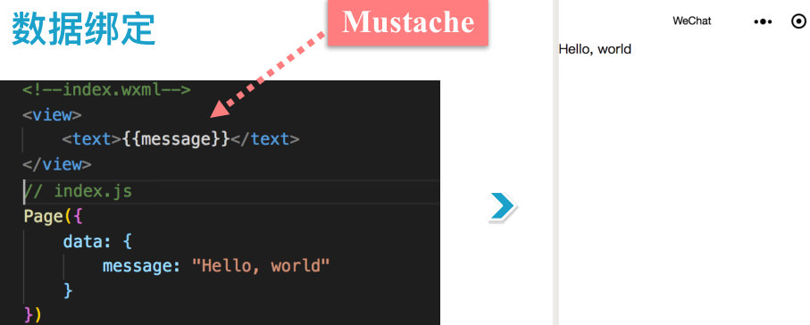

* data-* 数据绑定

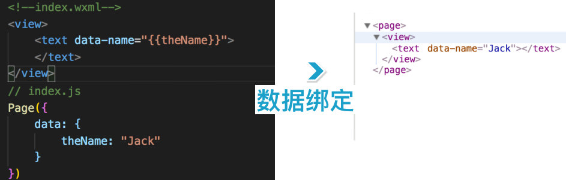

* 三元运算符绑定

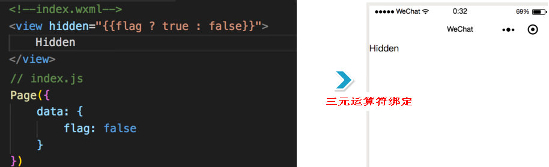

---


## 3 WXML列表渲染
```
  wx:key="index" 不推荐使用index 数字作为 key，应该用唯一的 key

  wx:key 重新排序，提升效率
```


## 4 if条件渲染
* if 和 hidde的区别
  * if & hidden 都能控制元素的显示
```
  if 切换时，框架会有一个局部渲染的过程，
    确保条件块，在渲染时会销毁重新渲染

  hidden 始终都会渲染，频繁切换显示用 hidden
    有更高的初始化性能消耗
```

---


## 5 模板引用 import & include
* import 会忽略 tempalte之外的所有标签
* import 有作用域，目标文件有嵌套其他模板是不会被引用的
  * 避免了引用模板死循环的问题
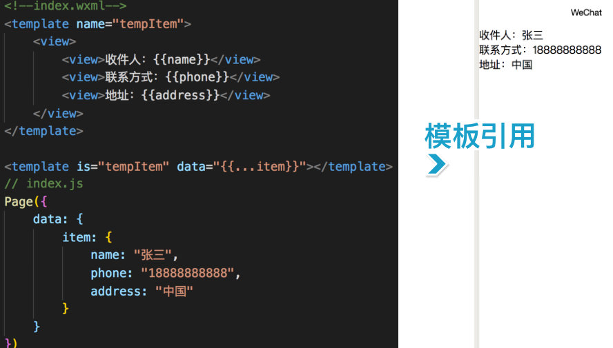

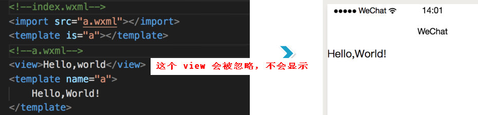

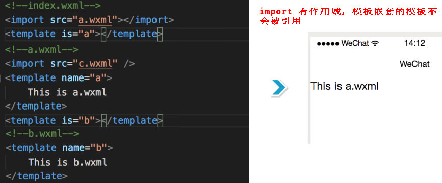


* include
  * 直接忽略 template属性
  * 目标文件内，除了 template 所有的代码都引入
  * 相当于直接拷贝了 include的位置这里

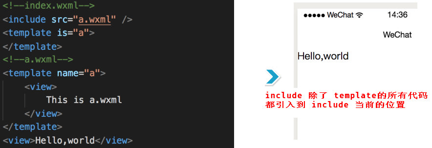
