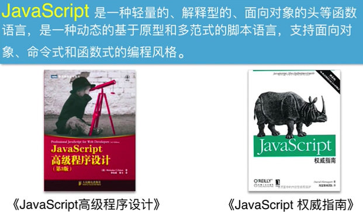
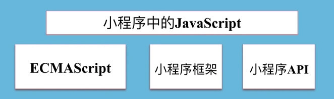
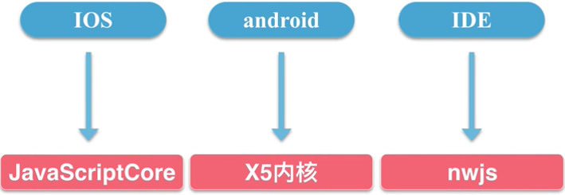
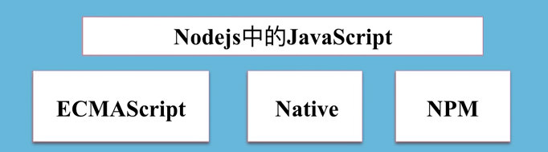
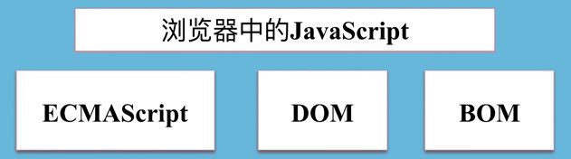
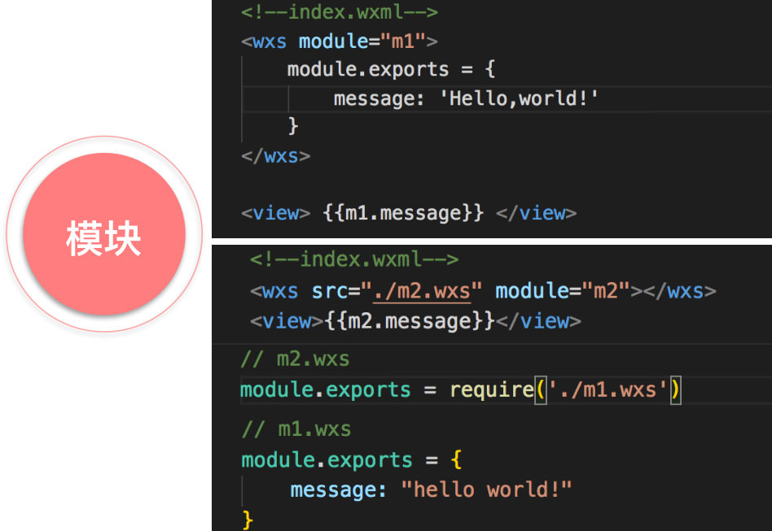
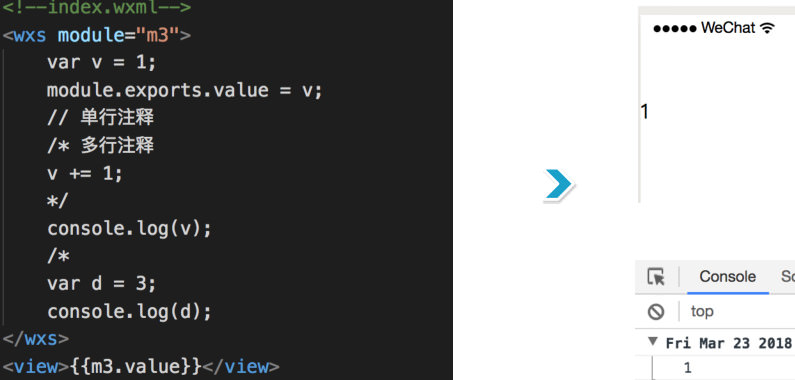

# WXS WeiXin Script 微信小程序的脚本语言
* WXS 就是微信对 JS做了一些封装和限制,类似于 JS
* WXS没有 BOM 和 DOM，不支持 jquery & zepto等JS库
  * WXS 没有 JS Native，不能使用原生库 和 npm
  
* 什么是 JS



[TOC]


## 1 WXS 和 JS的区别

* 小程序 中的 JS


* 小程序JS的运行机制
  * nwjs 有 chrome webview 来渲染
  * node-webkit js


* Node.js 中的 JS


* 浏览器中的 JS


---


## 2 WXS的语法
* 模块
  * wxs 导入模块 ` module.exports = {} `
  * WXS 模块是私有的，对外不可见，在一个页面内部，不要重复声明 wxs模块名，否则，后面的会覆盖前面的
  

* 变量
  * 变量和 JS的变量一样 只有 ` var `

* 语句
  * 和 JS语句一样
  * ` if else, do while, switch, for(){} `
  * 不支持 ` try{} catch(e) {} ` 语句

* 注释
  ```
  //    单行注释
  /* */ 多行注释
  ```
  

* 运算符
  * 基本运算符
    * ` + - * / ` 的运算

  * 等值运算符
    * ` = == === !== !=` 全等，非全等运算

  * 赋值运算符
    * ` a=a+1  a=a-1 `

  * 一元运算符
    * 自增，自减，正负值运算

  * 二元逻辑运算符
    * ` a && b  a & b `
  
  * 三元运算符
    * ` a ? b : c ` 

  * 位运算符
    * 左移，右移，按位与，按位或

  * 比较运算符
    * ` > < >= <= ` 大于， 小于 大于等于等
  

* 数据类型
  * number
  * string
  * boolean
  * object
  * array
  * function
  * date
  * regexp
    * 生成date，需要 get.date() 函数
    * 生成regexp，需要 get.regexp() 函数,不能使用 new运算符来生成

  * construct 来判断数据类型

* 基础类库
  * Number
  * Date
    * Date.path() 解析日期，返回 unix时间戳
    * Date.now() 返回当前时间的时间戳
    * Date.utc() 返回指定时间的时间戳

  * Global
  * console
    * 只有 ` console.log() `

  * Math
  * JSON

---

