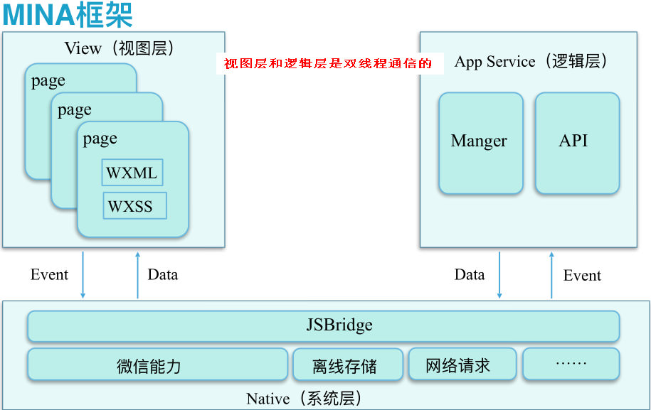
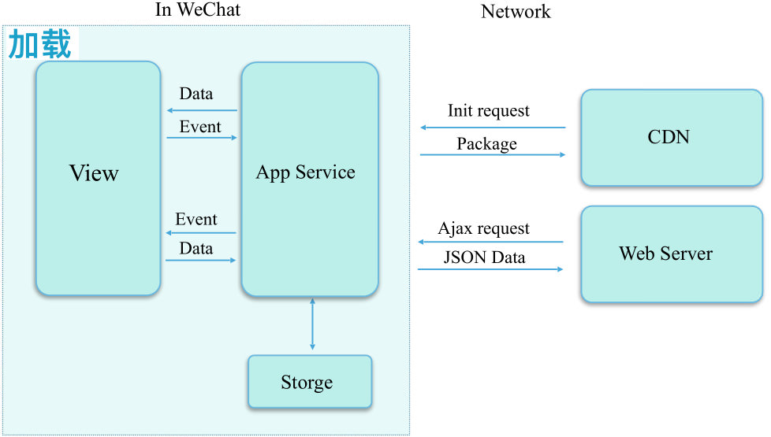
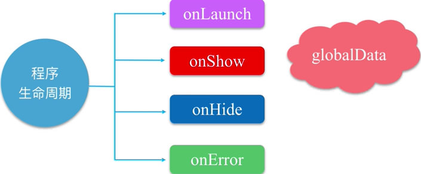
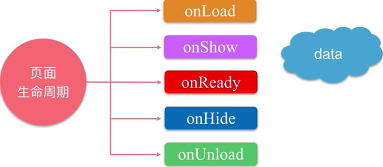
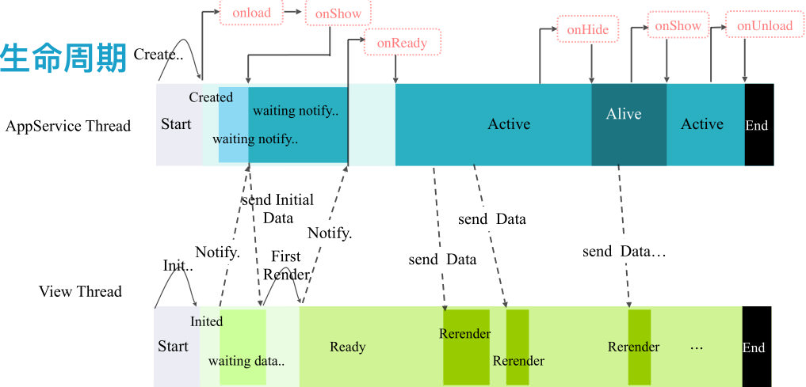
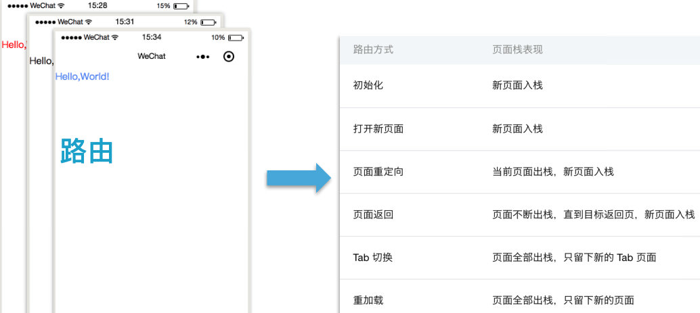
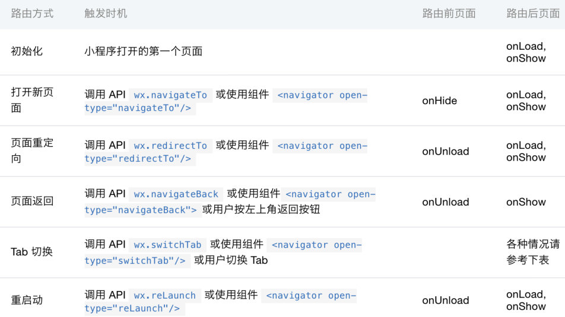

# 小程序 MINA框架
* wxml 是节点树结构，每个节点树都有一个上下文环境
* AST 抽象语法树
* App server线程 常驻内存



[TOC]


## 1 小程序运行机制
1. 冷启动
  * 第一次打开，或小程序被微信销毁后再次启动
  * 冷启动时，发现新版本，会异步下载最新版本的代码包，并同时利用微信客户端的包进行启动
  * 最新小程序包，会在下次打开应用上
    * 如何需要用到最新代码包，用一个API来处

2. 热启动
  * 已经打开过小程序

* 什么时候销毁？
  * 进入后台，超过5分钟会自动被微信销毁
  * 短时间内，连续2次收到系统告警，短时间间隔是 5秒

---


## 2 小程序加载机制
* 网络不好的情况下，感觉启动时间长一些


---


## 3 小程序生命周期
1. 小程序应用的生命周期
```
onLaunch

onShow
  唤醒后台小程序

onHide
  点击右上角关闭小程序触发

onError
  API调用失败

```



2. 小程序页面的生命周期
```
onLoad
  页面第一次加载，页面没被销毁，只会调用一次

onShow

onReady
  页面渲染完成，页面没被销毁，只会调用一次

onHide

onUnload
  关闭当前页
```



3. 小程序生命周期


---


## 4 页面路由
* 所有的页面路由，都有框架进行管理，以栈的形式维护了小程序页面




* 路由的触发方式和生命周期函数
```
// API 调用
wx.navigateTo
  页面重定向
  <navigator open-type="navigateTo"/> 组件调用
 
wx.navigateBack
  页面返回

wx.switchTab
  Tab切换

wx.reLaunch
  重新启动
```

