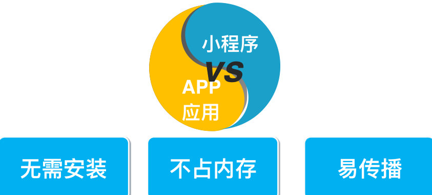
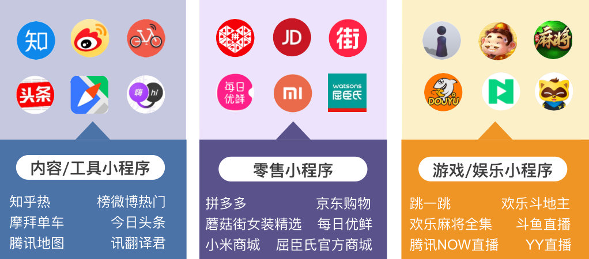
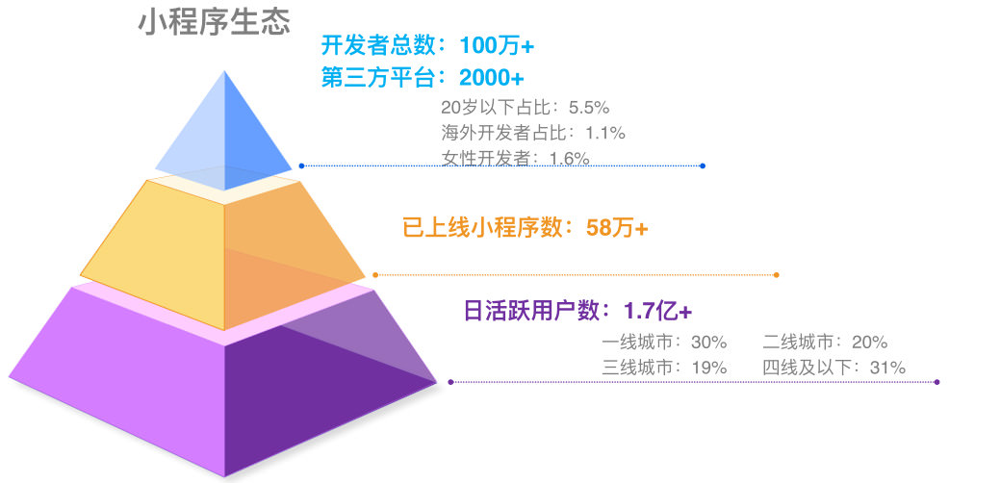
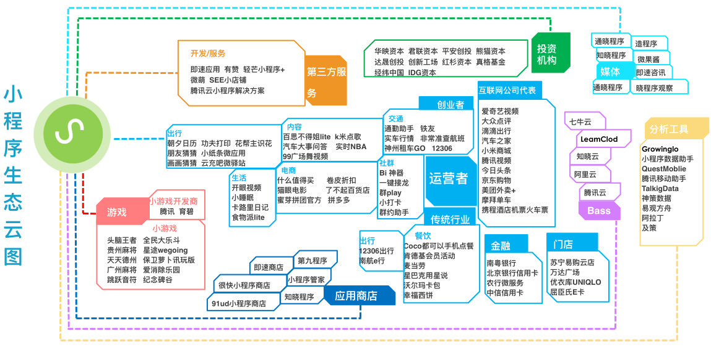

# 学习小程序的好处
> 微信小程序

[TOC]

## 1 小程序介绍，什么是小程序？

* 小程序是一种不需要下载安装的应用，实现了“触手可及的”应用
  * 方便，实用，更好的应用体验
  * 在微信内使用的应用程序功能

* 用户扫一扫或者搜一下即可打开应用，体现了用完即走的理念
  * 多个入口，扫描二维码，搜一搜，分享小卡片

* 用户不用关心是否安装太多应用的问题，应用随时可用，但又无需安装
  * 微信小程序小程序的传播性，要比APP更广泛更灵活
  

* 小程序和应用程序的区别

---

## 2 小程序能做什么
* 小程序和应用程序所具备的能力是差不多的

---

## 3 小程序从业前景和发展
* 小程序是新的应用场景，行业内对小程序的关注度和期待很高
* 招聘需求很大
* 培养使用微信小程序的习惯
* 多关注其他小程序
  

* 微信小程序已达到58万多
---

## 4 小程序的生态圈和发展

## 5 小程序语法的缺点
1. 不能使用npm ，只能使用 import 和 include，扩展受限
2. 需要为小程序单独写代码，不能和web共用
3. 开发效率和学习成本，小程序特有的语法

