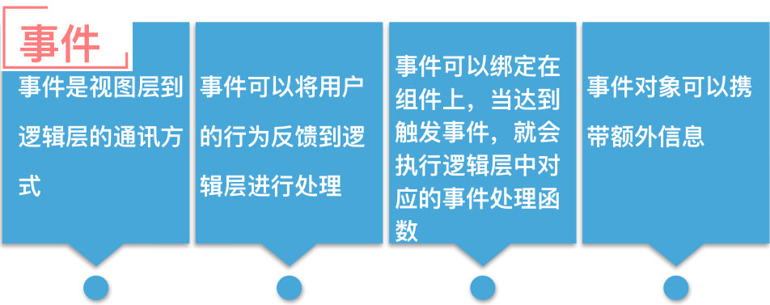

# 小程序事件流

[TOC]


## 1 小程序事件流
* 什么是小程序事件


* 小程序事件


---


## 2 小程序事件的捕获和冒泡
* 小程序的事件处理阶段


* 捕获的事件
```
  touchstart 手指按下屏幕
  touchmove  手指按下屏幕移动
  touchcancel 来电提醒打断的时候
  touchend  手指离开屏幕 

  tap  点击屏幕一次的操作
  longpress 手指按下屏幕超过 350ms之后的操作
    推荐使用  longpress，不会触发 tap事件
  longtap，触发后，会继续出发 tap的事件
```

* 冒泡的事件
```
  touchstart
  touchmove
  touchcancel
  touchend

  tap
  longpress
  longtap

  transitionend 动画事件
    渐变动画结束后会触发 transitionend
  animationstart
  animationend 动画结束后的调用
  animationiteration 动画执行一次迭代的调用
  touchforcechange 触发 3D touch事件
```

