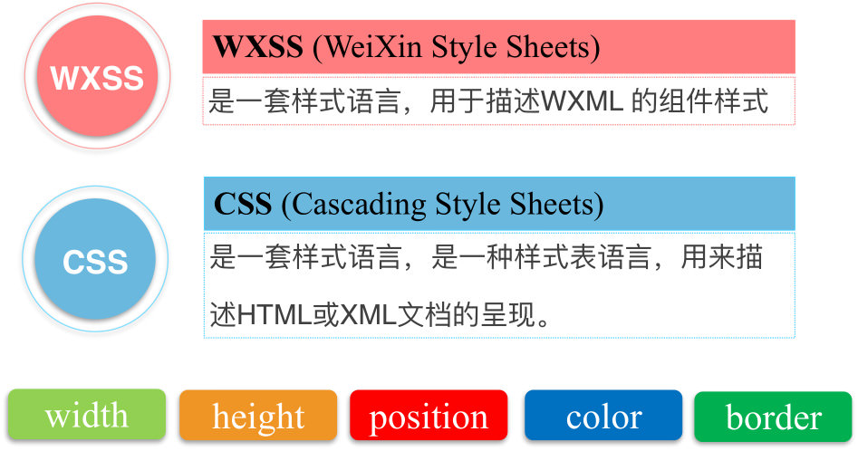
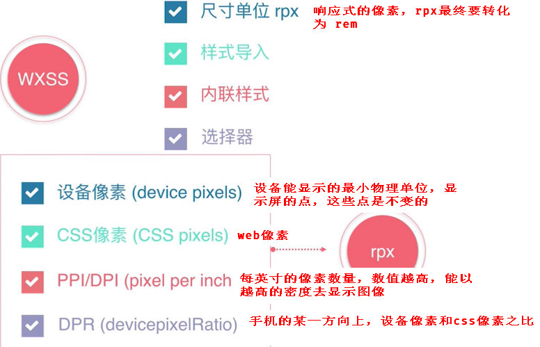
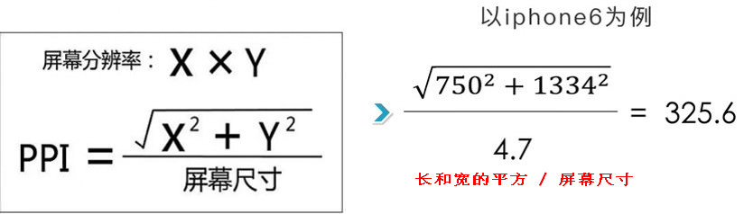
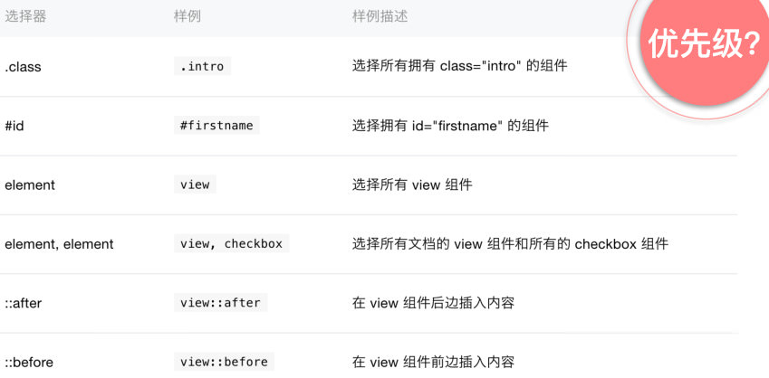
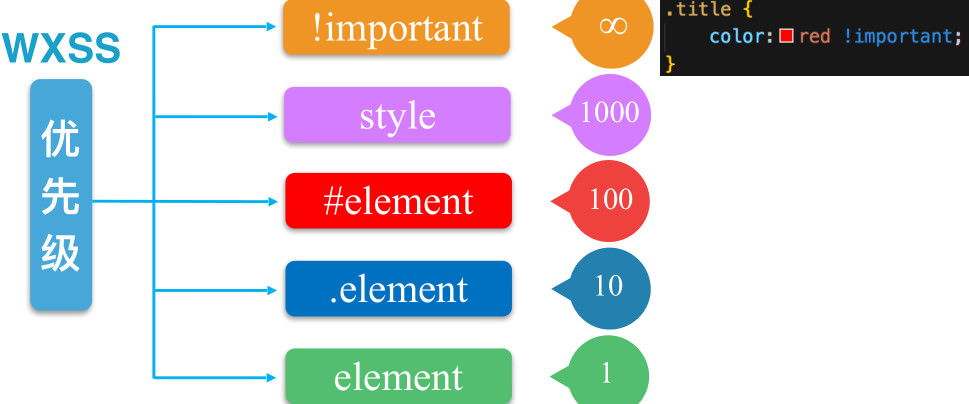
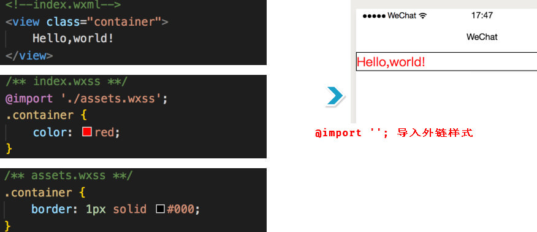
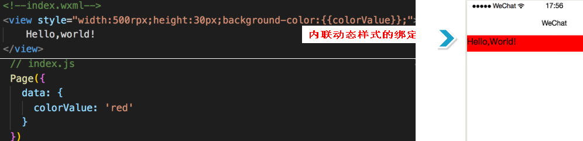

# WXSS语法

[TOC]

## 1 WXSS 是什么
* WXSS WeiXin Style Sheets，描述 WXML的样式，类似 CSS

---

## 2 WXSS rpx
* rpx的最大宽度是 750rpx，
* rpx 响应式像素

---

## 3 WXSS 选择器

* WXSS 选择器

* WXSS选择器的优先级

---

## 4 WXSS 样式
* WXSS 样式执行顺序

* ` @import '' ` 导入外链样式

* 动态样式写在 style，静态样式写在 class里面

